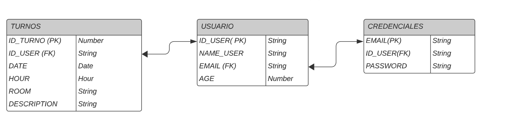

# Proyecto M3

## Historia de Usuario

1. Como usuario invitado o anónimo quiero poder registrarme
	a. Rellenar un formulario con mis datos
	b. crear un acceso o credenciales

2. Como usuario invitado, registrado quiero poder logearme.

3. Como usario registrado quierpo poder recuperar mis credenciales. 
	a. Formulario de recupero de credenciales.

4. Como usuario regsitrado / logueado quiero poder reservar un turno
	a. Formulario para reservar turno

5. Como usuario registrado / logueado quiero poder ver mi historias de turnos

6. Como usuario registado / loqgueado quier poder gestionar mis turnos

7. Como usuario registardo/logueado quiero poder cerrar la sesión cuando no
use mas la plataforma

## Modelo Entidad Relacion

